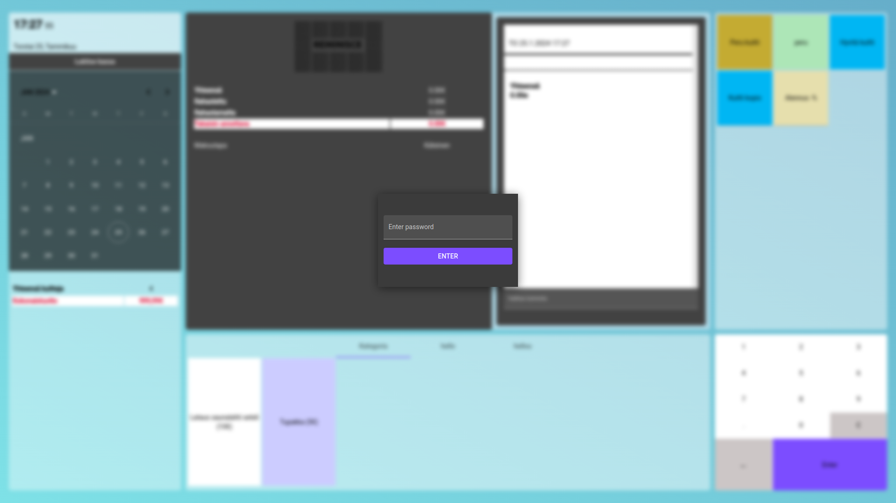
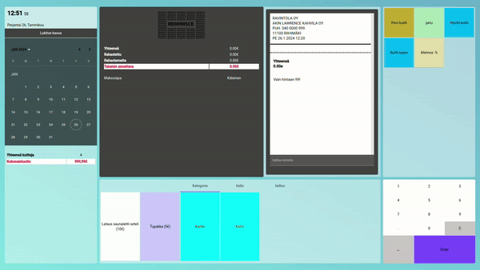
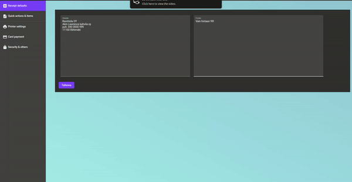

# Cash register
### About the app

This app was created as a simple demo for what cafes and other small companies could be using for their customers to manage their money exchanges. It simplifies the math needed by the cashier so that they do not need to do a lot of thinking while being tired. This app is mainly written in Angular using other tools along it.

## Features
#### Manager 
* Change password 
* receipt history
* lock, and add custom options to pressable items
* And much more...

#### General
* Can create a printable pdf file that the application will send to the printer
* Buttons in the screen can be clicked so that the use for touch would be possible
* Can send a signal to open physical cash box
* all data is stored locally and is always accesable even when application is deleted
* And much more...

## How the app looks
This is how it iniatially looks asking for password
 

Then now its followed by this
 

Settings can be done in this seperate window
 

